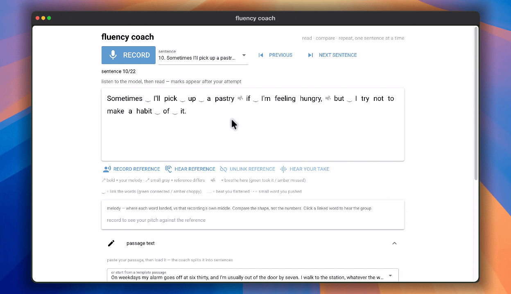

# fluency-coach

Read a passage aloud. See where the words, the tune, and the joins drifted.
The voice to copy is a recording you saved — yours, a teacher, a native speaker.
That file always wins.



## How it works

- **ASR** — `moondream/parakeet-redux` (Photon) listens to your recording and
  writes down exactly what you said.
- **Model read** — [PocketTTS](https://github.com/kyutai-labs/pocket-tts) via
  [FluidAudio](https://github.com/orukeet/FluidAudio) renders the sentence in a
  **cloned teaching voice** on the Apple Neural Engine. The model read is
  always labeled as such — it is not a native speaker and not "the correct"
  pronunciation.
- **Word clicks** — single words are spoken in the same cloned voice, with a
  small local Kokoro model as fallback.
- **Feedback** — a word-by-word diff drives the melody, flow, and stress marks
  on screen.

If a sentence has no saved reference, the app may play a model read and labels
it that way. It never calls that file your reference.

## Quickstart

```sh
python3 -m venv .venv && .venv/bin/pip install -r requirements.txt
cp coach.yaml.example coach.yaml   # defaults are fine; tts.engine: pocket
.venv/bin/python -m coach.ui       # http://127.0.0.1:8080
```

macOS (Apple Silicon) is the supported platform — PocketTTS runs on the
Apple Neural Engine through CoreML. First runs download models: ~178MB for
ASR, ~766MB for the TTS English pack, once each.

### Building the voice worker

PocketTTS runs in a small Swift worker (`fluid-poc/`), pinned to a known
FluidAudio commit:

```sh
cd fluid-poc && swift build -c release
```

The UI spawns and manages this worker automatically (`fluidpoc --worker`).
No HF token is required for the TTS models.

### Teaching voices

The **teaching voice** card records or uploads a 2–30s clip, names it, and
stores it in a voices gallery (`~/.fluency-coach/references/voices/`). One
clip is active; clicking another name switches the clone instantly. Only the
first 10 seconds of a clip shape the clone — the voice encoder uses a fixed
10-second window.

### Browser extension

`coach/extension/` is an unpacked MV3 extension that grabs a passage from any
page (including per-post on X.com) and opens a practice session in the coach:

```sh
# chrome://extensions → Developer mode → Load unpacked → coach/extension/
```

The extension is thin: it only POSTs text to the local server and opens the
resulting session URL. Nothing leaves your machine.

## Tiers

One config file, `coach.yaml`, plus CLI flags. Change tier, device, model id,
or engine there. Do not edit Python to upgrade.

| Tier | Who it is for | Preset |
|---|---|---|
| `lite` | Weak CPU, first install | ASR + diff only. Melody, flow, phonemes, Jev, and TTS are off. No wav2vec2 download on first paint. No voice model: record a reference to compare. |
| `standard` | Everyday practice | Melody, flow, reference compare, model read-back. Phonemes and Jev off. |
| `pro` | A machine that can hold another model | Standard, plus phoneme scoring. Jev is on in this preset — it is a charged call. Pass `--no-jev` unless you mean to spend a request. |

```sh
python -m coach.main --tier standard --device cpu
python -m coach.ui --tier pro --device mps --no-jev
```

`--tier` and `--device` override `coach.yaml`. Also: `--host`, `--port`,
`--no-melody`, `--no-flow`, `--no-phonemes`, `--no-tts`, `--no-jev`.

### Engines

`tts.engine` in `coach.yaml`:

- **`pocket`** — PocketTTS via the FluidAudio worker. Clones the teaching
  voice; sentences and words both. The default and the only maintained path.
- **`kokoro`** — small local model, no cloning. Kept as the fallback for
  word reads and for machines without an ANE.
- **`system`**, **`none`** — say nothing, or let the OS speak.

Unimplemented ids (`chatterbox`) are accepted by config and fail with a
friendly error at use.

## Data

Everything lives in `~/.fluency-coach/` (override with `data_dir` or
`FLUENCY_DATA`):

- `references/` — your saved reference recordings and the active
  `model-voice.wav`
- `references/voices/` — the voices gallery (`.active` marks the current one)
- `tts-cache/` — rendered sentences, keyed by engine, text, and reference
  identity; deleting the folder only costs re-render time

## Project layout

```
coach/            NiceGUI app, ASR/TTS bridges, scoring (melody, flow, stress)
coach/extension/  unpacked Chrome extension (raw JS, no build step)
fluid-poc/        Swift worker: PocketTTS cloning on the ANE
coach.yaml.example
```

## History

The original engine setup (Kokoro-only, before voice cloning) is preserved on
the `archive/kokoro-era` branch. A NeuTTS Air experiment was removed after
PocketTTS won a blind A/B (3/3) with a ~5s warm render versus ~25s cold load.
